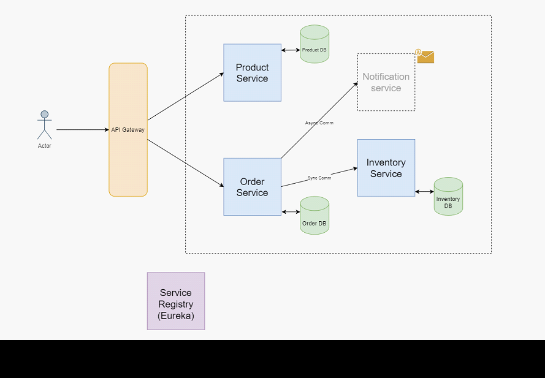

# online-store-microservices

* Product Service: Create and view products.
* Order Service: Can order products.
* Inventory Service: Can check if product is in stock or not. Order and Inventory services will 
communicate to each other synchronously using REST API

## API:
* GET  api/v1/product
* POST api/v1/product
* POST api/v1/order
* GET  api/v1/order
* POST api/v1/inventory/isinstock
* GET  api/v1/inventory

## Prerequisites

Before running the project, ensure that you have the following installed:

1. JDK (Java Development Kit) - Version 17
2. Maven - Build tool for Java projects
3. Docker Desktop - To run the microservices in containers

## Steps

Follow the steps below to set up and run the project:

1. Clone the repository to your local machine.
2. Navigate to the 'online-store-microservices' folder.
3. Run the following command to build and run the tests: $ mvn clean verify
4. Start the microservices using Docker by running the following command: $ docker compose up -d
5. Open Postman and import the [Microservices.postman_collection.json](Microservices.postman_collection.json) API collection to test the APIs.

Please make sure you have the necessary dependencies and configurations in place before running the project. Refer to the official documentation of each tool for installation instructions if needed.

